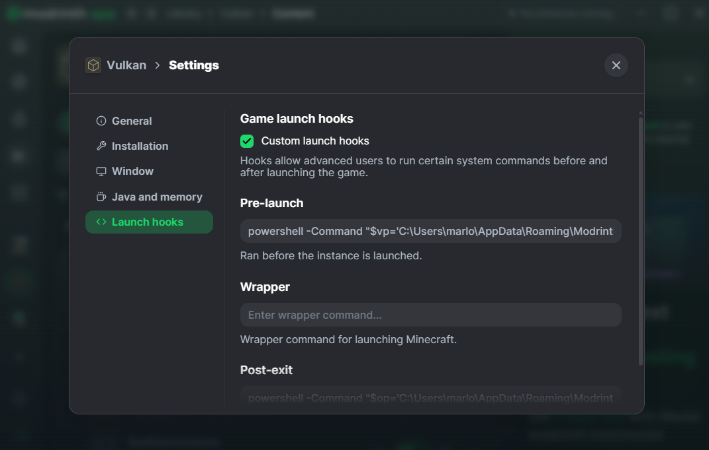
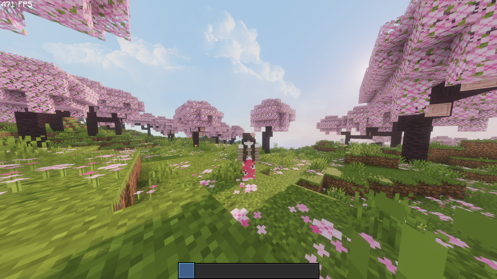

# Vulkan Window Fix

**Made by K1wit**

---

## Why was this mod made?

VulkanMod is a Minecraft mod that replaces the OpenGL renderer with Vulkan, giving massive FPS boosts — sometimes up to 3000 FPS on capable hardware. However, it comes with a major issue: every time you change any in-game setting, VulkanMod rewrites its config and resets the window mode, breaking borderless window. On top of that, resource packs with GUI elements cause crashes if loaded during startup. This mod was made to fix both of these problems automatically.

---

## What does it do?

- Automatically disables VSync on every game start so borderless window stays working
- Works alongside two launch hooks that fix the window mode and handle resource pack loading safely

---

## Installation

1. Download and install **VulkanMod** and **Borderless Windowed Vulkan**
2. Drop `vulkan-window-fix.jar` into your mods folder
3. Open your launcher's profile settings and find the **Game launch hooks** or **Pre/Post launch commands** section
4. Enable custom launch hooks if required
5. Paste the **pre-launch hook** into the Pre-launch field
6. Paste the **post-exit hook** into the Post-exit field
7. In both hooks replace `USERNAME` with your Windows username and `PROFILENAME` with your profile folder name

> Supported launchers: **Modrinth**, **Prism Launcher**, **MultiMC**, **ATLauncher**



---

## Pre-launch Hook

```
powershell -Command "$profile='C:\Users\USERNAME\AppData\Roaming\ModrinthApp\profiles\PROFILENAME';$vp=$profile+'\config\vulkanmod_settings.json';$v=Get-Content $vp|ConvertFrom-Json;$v.windowMode=0;$v|ConvertTo-Json|Set-Content $vp;$rp=$profile+'\resourcepacks';$packs=@('\"vanilla\"')+(Get-ChildItem $rp -Filter '*.zip'|ForEach-Object{'\"file/'+$_.Name+'\"'});$line='resourcePacks:['+($packs-join',')+']';$op=$profile+'\options.txt';$c=Get-Content $op;$c=$c -replace 'enableVsync:false','enableVsync:true' -replace 'fullscreen:true','fullscreen:false';$c=$c|Where-Object{$_ -notmatch '^resourcePacks:'};$c+=$line;$c|Set-Content $op"
```

## Post-exit Hook

```
powershell -Command "$profile='C:\Users\USERNAME\AppData\Roaming\ModrinthApp\profiles\PROFILENAME';$op=$profile+'\options.txt';(Get-Content $op) -replace 'enableVsync:false','enableVsync:true'|Set-Content $op"
```

---

## Resource Packs

The pre-launch hook automatically scans your resourcepacks folder and loads all `.zip` files on startup. This means you never have to manually re-enable your resource packs after launch. Simply drop any pack into your resourcepacks folder and it will be included automatically next boot.

> **Note:** Resource packs must not be active before launch — the hook handles this for you.

---

## Note for Prism / MultiMC Users

The profile path will be different from Modrinth. Navigate to your instance folder and use that path instead of the ModrinthApp path.

---

